# db-capstone-project

## Week 1

The task of this week is to develop a ER diagram and to write a schema using the ER diagram in MySql workbench.
 
#### Task - Setting up a new user in mysql database.
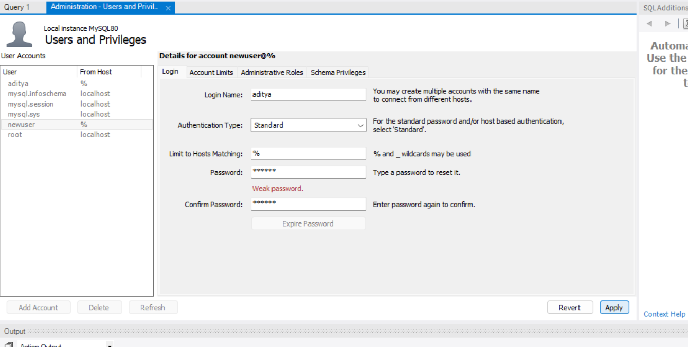
#### Task - Connection test of new user
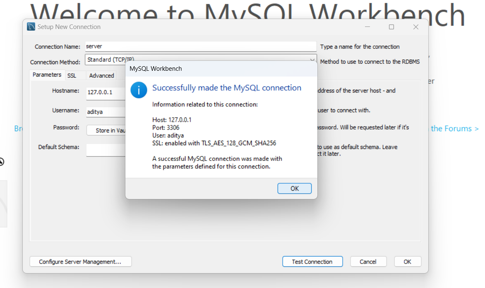
#### Task - Creating a normalized ER diagram

#### Task - To show the database in mysql server
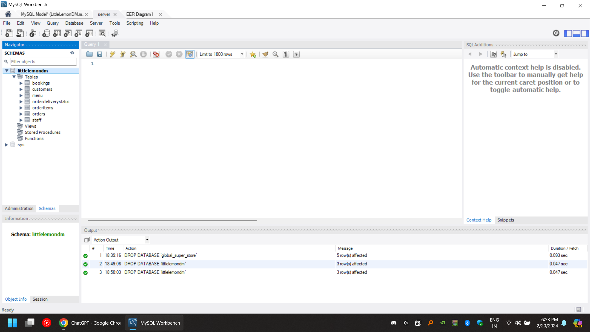

## Week 2
The main task of this week is to create a sales report and a table booking system.
The relevant files are in the week 2 folder

## Week 3
The Task main task of this week is data visualization using tableau and database client using python.
### Tasks Based on Tableau
#### Task - Connecting to Excel File.
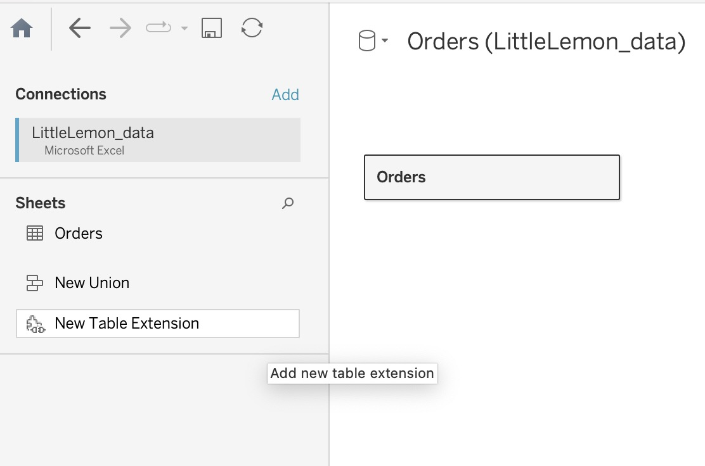
#### Task - Splitting Name
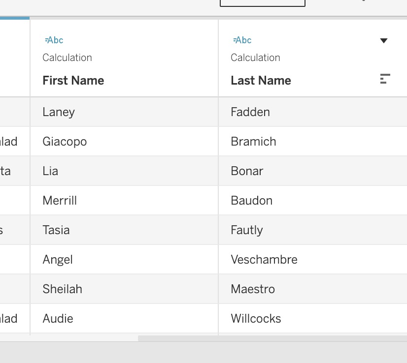
#### Task - Creating a calculated field
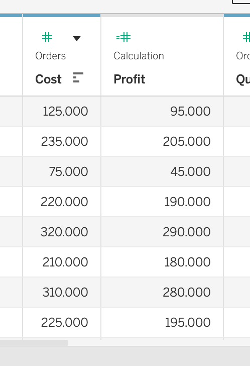
#### Task - Customer Sales Bar Graph
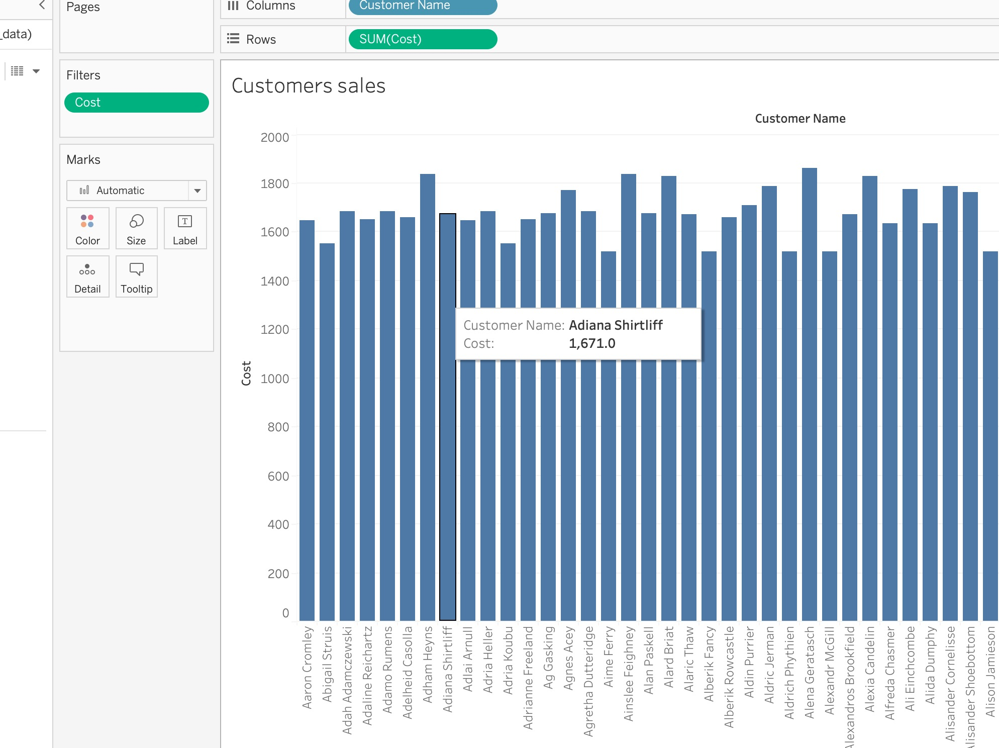
#### Task - Profit Chart Line Graph
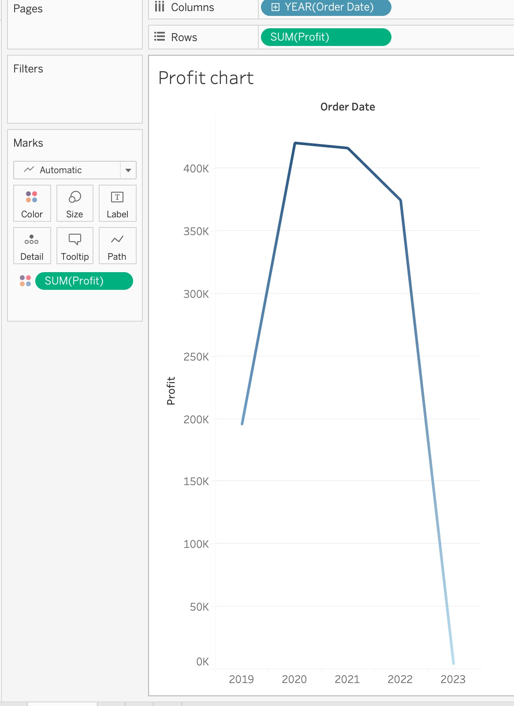
#### Task - Sales Bubble Chart
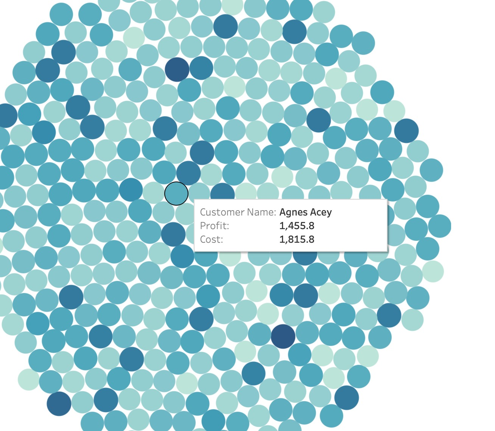
#### Task - Cuisine Sales and Profit
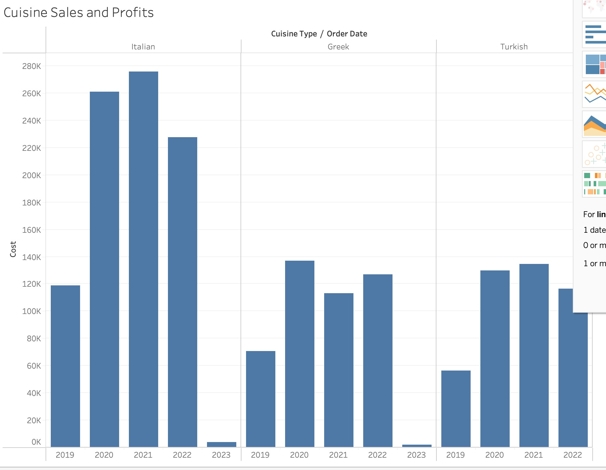
#### Task - Interactive Dashboard
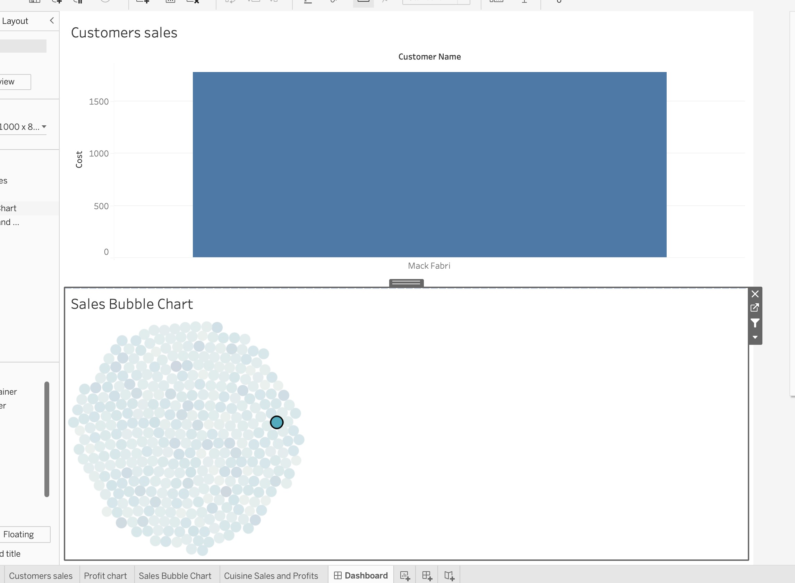

 

### Tasks based on python

#### Task - Connecting python to MySql Database

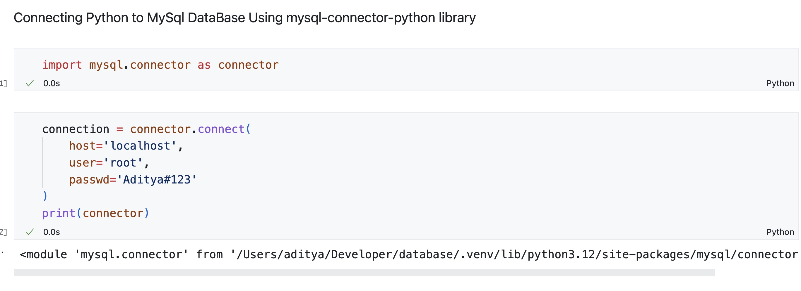
#### Task - To show all the tables in SQL Database
[show tables](./Week-3/ShowTables.jpg)
#### Task - To use Join clause
[using join clause](./Week-3/join.jpg)