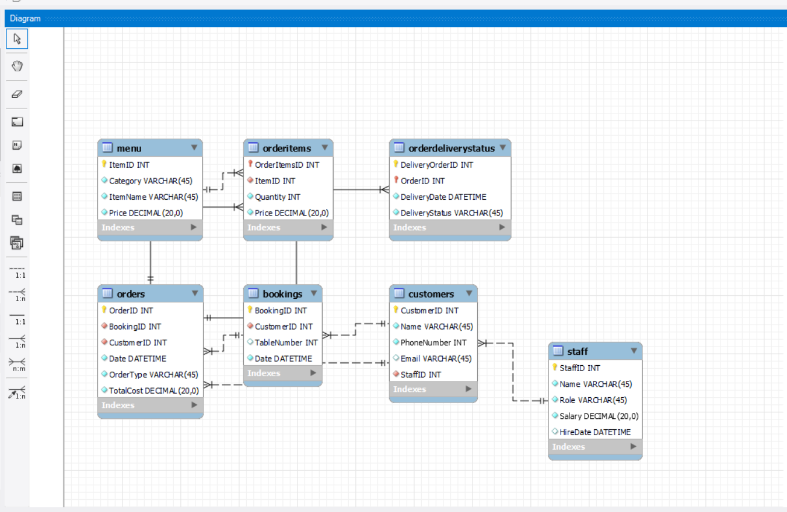
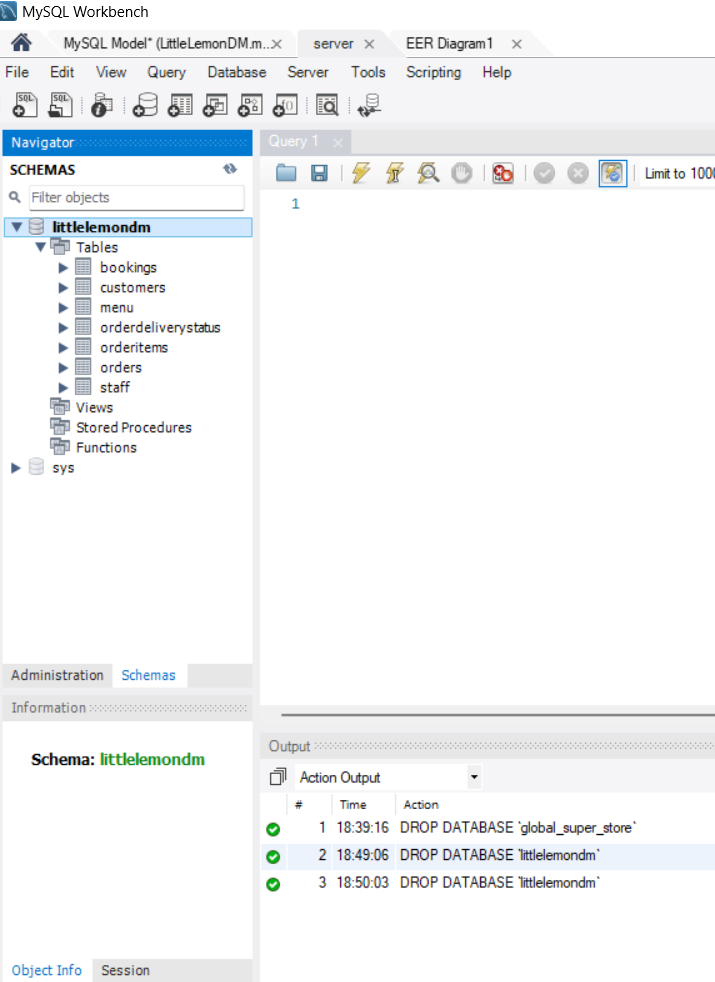

# db-capstone-project

## Week 1

The task of this week is to develop a ER diagram and to write a schema using the ER diagram in MySql workbench.
 
#### Task - Setting up a new user in mysql database.

#### Task - Connection test of new user

#### Task - Creating a normalized ER diagram

#### Task - To show the database in mysql server

## Week 2
The main task of this week is to create a sales report and a table booking system.
The relevent files are in the week 2 folder

## Week 3
The Task main task of this week is data visualization using tableau and database client using python.